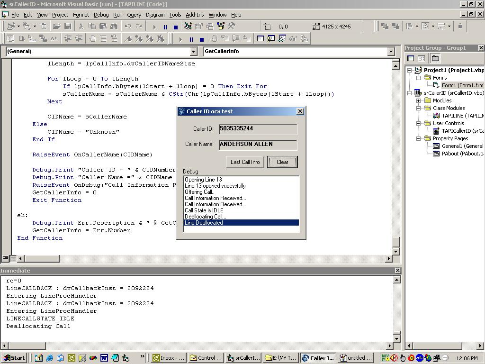



## Commercial Standard TAPI Caller ID ocx

### Description

This is my first submission to PSC. I posted this to .NET category by mistake. Hence i am posting it again under Visual Basic category.

The Caller ID ocx is an activex control written in pure Visual Basic using TAPI 2.0. This control works with any line device that supports TAPI. The device can be a voice modem or any telephony board like DIalogic etc. The control is able to detect Caller ID and Caller Name provided you have subscribed for Caller ID facility from your local telephone company and the line device also has Caller ID feature.

It May not work with voice modems properly. voice modems are often not very stable as far as TAPI is concerned. Make sure the proper driver is installed for the modem and the modem supports Caller ID feature. I tested with D-Link-562E+++ voice/fax modem and Dialogic D4/PCI voice board. It works fine for me. Please use it at your own risk. I am not responsible for any damage done to you.
 
### More Info
 
Select the appropriate Line ID from Control-&gt;Right Click-&gt;Properties-&gt;Settings-&gt;Line ID. Click Apply and run the project.

Before you run the project, Select the appropriate Line ID from Control-&gt;Right Click-&gt;Properties-&gt;Settings-&gt;Line ID. Click Apply and run the project.

Caller ID &amp; Caller Name

May not work with voice modems properly. voice modems are often not very stable as far as TAPI is concerned. Make sure the proper driver is installed for the modem and the modem supports Caller ID feature. I tested with D-Link-562E+++ voice/fax modem and Dialogic D4/PCI voice board. It works fine for me. Please use it at your own risk. I am not responsible for any damage done to you.

             |
---                |---
**Submitted On**   |2005-07-20 18:43:10
**By**             |[Sumanta Ray](https://github.com/Planet-Source-Code/PSCIndex/blob/master/ByAuthor/sumanta-ray.md)
**Level**          |Advanced
**User Rating**    |4.0 (40 globes from 10 users)
**Compatibility**  |VB 5\.0, VB 6\.0
**Category**       |[Custom Controls/ Forms/  Menus](https://github.com/Planet-Source-Code/PSCIndex/blob/master/ByCategory/custom-controls-forms-menus__1-4.md)
**World**          |[Visual Basic](https://github.com/Planet-Source-Code/PSCIndex/blob/master/ByWorld/visual-basic.md)
**Archive File**   |[Commercial192113852005\.zip](https://github.com/Planet-Source-Code/sumanta-ray-commercial-standard-tapi-caller-id-ocx__1-62079/archive/master.zip)

